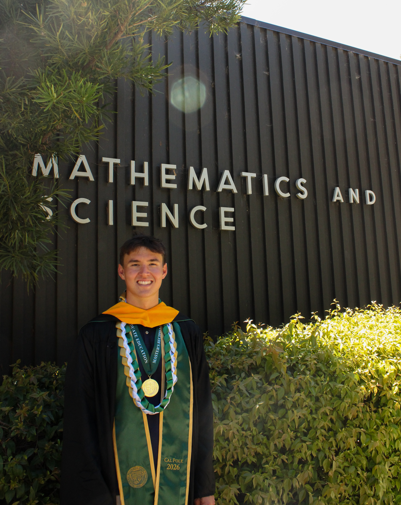

***

:::: {.grid}

::: {.g-col-12 .g-col-md-6}
{.rounded width="" fig-alt="Tyler Stoen"}
:::

::: {.g-col-12 .g-col-md-6}
My professional expertise is in statistical models and machine learning, built
on programming in R and Python. My recent work focuses on supervised and
unsupervised methods, including classification and correlation analysis, with
applications in biological areas like microbiome ecology and oncology.

I came to statistics through sports. I was always the one thinking about the
optimal way to play a game or the best lineup to field, and it became how I
connected with people. That instinct for finding the optimal strategy and
discovering the story through numbers is what motivates me in statistics and
data science today.

Outside of work, I like to stay active, cook, follow Bay Area sports, and I'm
always looking for new music.
:::

::::